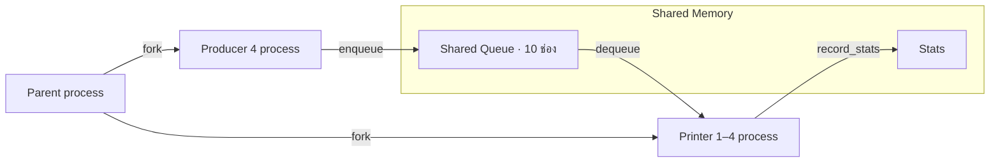

# Print Spooler Simulation System

โครงงานจำลองระบบจัดคิวงานพิมพ์สำหรับรายวิชา **Operating Systems** ศึกษาการทำงานของหลาย process ที่ใช้ทรัพยากรร่วมกันผ่านปัญหา **Producer–Consumer** โดยใช้ Priority Scheduling, Aging, Shared Memory และ Semaphore

โปรเจกต์ประกอบด้วยโปรแกรมภาษา C สำหรับทดลองกลไก POSIX จริง และเว็บ **Spooler Lab** สำหรับแสดงคิว เครื่องพิมพ์ เหตุการณ์ และสถิติ เพื่อช่วยเรียนรู้และสาธิตการทำงาน

[วิธีรันเว็บและโปรแกรม C](#วิธีรันโปรเจกต์)

## สมาชิกในกลุ่ม

รายชื่อตามสไลด์นำเสนอโครงงาน

| ชื่อ–นามสกุล            | รหัสนักศึกษา |
| ----------------------- | ------------ |
| นางสาวชุตินันท์ หมายสุข | 673380401-6  |
| นางสาวภัทราพร ศรีชนะ    | 673380419-7  |
| นายณัฏฐชัย ผลดี         | 673380581-8  |

## ที่มาและความสำคัญ

เมื่อผู้ใช้หลายคนส่งงานพิมพ์พร้อมกัน แต่มีเครื่องพิมพ์จำนวนจำกัด ระบบต้องจัดเก็บงานที่ยังพิมพ์ไม่ได้และตัดสินใจว่างานใดควรได้ใช้เครื่องก่อน การทำงานร่วมกันนี้เกี่ยวข้องกับปัญหาสำคัญของระบบปฏิบัติการ ได้แก่

- **การใช้ทรัพยากรร่วม:** ผู้ส่งงานและเครื่องพิมพ์หลายตัวต้องเข้าถึงคิวเดียวกัน
- **Race Condition:** การแก้ข้อมูลคิวพร้อมกันโดยไม่มีการประสานงานอาจทำให้ข้อมูลผิดพลาดหรืองานถูกนำออกซ้ำ
- **การจัดลำดับความสำคัญ:** งานด่วนควรมีโอกาสได้พิมพ์ก่อนงานทั่วไป
- **Starvation:** งานที่สำคัญน้อยอาจถูกงานใหม่แซงต่อเนื่อง จึงต้องมีกลไกเพิ่มโอกาสให้งานที่รอนาน

โครงงานนี้ใช้สถานการณ์ดังกล่าวเป็นกรณีศึกษาของการสร้าง process การสื่อสารระหว่าง process และการควบคุม critical section

## วัตถุประสงค์

1. จำลองผู้ใช้หลายคนส่งงานพร้อมกันและใช้เครื่องพิมพ์ร่วมกัน
2. ให้หลาย process เข้าถึงคิวร่วมอย่างถูกต้องด้วย Shared Memory และ Semaphore
3. ศึกษาการเลือกงานด้วย Priority และการใช้ Aging เพิ่มความสำคัญให้งานที่รอนาน
4. ประเมินเวลารอและการกระจายงานเมื่อเปลี่ยนจำนวนเครื่องพิมพ์หรือเปิด–ปิด Aging
5. แสดงขั้นตอนผ่านเว็บเพื่อให้ติดตามและอธิบายการทำงานของโปรแกรมได้ง่าย

## ภาพรวมของระบบ

โปรแกรมหลักสร้าง **Producer 4 process** แทนผู้ใช้ 4 คน แต่ละคนส่งงาน 5 งาน รวม **20 งานจริง** ลงในคิวร่วมที่จุได้ **10 งาน** จากนั้น Printer ซึ่งทำหน้าที่เป็น Consumer จะเลือกงานออกไปพิมพ์

ค่าเริ่มต้นใช้ Printer 1 เครื่องและเปิด Aging โดยรองรับเครื่องพิมพ์ 1–4 เครื่องเพื่อศึกษาผลของการพิมพ์งานพร้อมกัน



| รายการ              | การทำงานในโค้ด                                  |
| ------------------- | ----------------------------------------------- |
| Producer            | 4 process แต่ละตัวสร้าง 5 งาน                   |
| งานทั้งหมด          | 20 งาน ไม่รวมสัญญาณ SHUTDOWN                    |
| คิวร่วม             | Bounded Buffer ขนาด 10 ช่อง                     |
| Printer             | 1–4 process ค่าเริ่มต้น 1                       |
| Priority เดิม       | 1–5 โดย **P1 สำคัญสูงสุด** และ P5 สำคัญต่ำสุด   |
| จำนวนหน้าต่องาน     | สุ่ม 1–8 หน้า                                   |
| ช่วงพักของ Producer | 100–499 ms หลังส่งงานแต่ละชิ้นสำเร็จ            |
| เวลาจำลองการพิมพ์   | 200 ms ต่อหน้า                                  |
| Aging               | ลดค่าที่ใช้เลือกงานลง 1 ทุก 2,000 ms ที่รอในคิว |

ชื่อไฟล์ เช่น `user3_doc0.txt` เป็นข้อมูลประกอบงาน โปรแกรมจำลองเวลาพิมพ์โดยไม่ได้เปิดเอกสารหรือสั่งเครื่องพิมพ์จริง รหัส `#103` หมายถึง Producer 1 สร้างงานลำดับ index 3 หรืองานชิ้นที่ 4

## หลักการทำงาน

### Priority Scheduling และ FIFO

เมื่อ Printer ว่าง ระบบสแกนงานในคิวแล้วเลือกตามกติกาต่อไปนี้

1. เลือกงานที่มี **Effective Priority เป็นตัวเลขน้อยที่สุด**
2. หากค่าเท่ากัน เลือกงานที่มีเวลาเข้าคิวเก่ากว่า
3. หากเวลาเข้าคิวตรงกันถึงมิลลิวินาที ใช้เลขลำดับเข้าคิวที่น้อยกว่า (`enqueue_seq` ใน C และ `enqueueSequence` ในเว็บ)

จึงรักษา FIFO ระหว่างงานที่มีระดับเท่ากัน แม้ตำแหน่งเก็บในอาร์เรย์จะเปลี่ยนไปหลังนำงานท้ายมาทับช่องที่ถูกนำออก การเพิ่มงานใช้ O(1) และการเลือกงานใช้ O(n) โดย n ไม่เกิน 10

ระบบเป็น **Non-preemptive**: Printer พิมพ์งานที่รับไปแล้วจนจบ ก่อนเลือกงานใหม่จากคิว

### Aging และการลดโอกาสเกิด Starvation

Aging เพิ่มความสำคัญให้งานที่รอนาน โดยคำนวณค่าใหม่เมื่อเลือกงาน

```text
effective_priority = priority - floor(wait_ms / 2000)
```

| งานเดิม P5 รอในคิว | Effective Priority |
| ------------------ | ------------------ |
| 1,999 ms           | 5                  |
| 2,000 ms           | 4                  |
| 6,000 ms           | 2                  |
| 8,000 ms           | 1                  |
| 12,000 ms          | -1                 |

Priority เดิมของงานยังคงอยู่ในช่วง 1–5 ส่วน Effective Priority ลดถึง 0 หรือติดลบได้ตามโค้ด ตัวอย่างเช่น P5 ที่รอ 8 วินาทีมีค่า 1 เท่ากับ P1 ที่เพิ่งเข้าคิว จึงเลือก P5 ที่เข้าคิวก่อน

Aging ช่วยเพิ่มโอกาสให้งานเก่า แต่ไม่ได้รับประกันว่าเวลารอเฉลี่ยของทุก Priority จะลดลงหรือเรียง P1–P5 เสมอ โครงงานมีงานจำกัด 20 ชิ้น จึงเป็นการสาธิตกลไก ไม่ใช่ข้อพิสูจน์ว่าจะไม่มี Starvation สำหรับทุกระบบที่รับงานต่อเนื่อง

### Shared Memory และ Semaphore

ในโปรแกรม C ทุก process ใช้ `SharedQueue` เดียวกันผ่าน `shm_open()`, `ftruncate()` และ `mmap()` แบบ `MAP_SHARED` โดยเก็บงาน สถิติ และ Semaphore ไว้ในพื้นที่ร่วม ก่อนสร้าง process ลูกด้วย `fork()`

Semaphore ทั้ง 4 ตัวถูกสร้างด้วย `sem_init()` และ `pshared = 1` เพื่อใช้งานระหว่าง process

| Semaphore      | ค่าเริ่มต้น | หน้าที่                                                    |
| -------------- | ----------- | ---------------------------------------------------------- |
| `mutex`        | 1           | ป้องกันหลาย process อ่านแก้คิวใน critical section พร้อมกัน |
| `empty_slots`  | 10          | ควบคุมจำนวนช่องว่าง Producer รอเมื่อคิวเต็ม                |
| `filled_slots` | 0           | ควบคุมจำนวนงานในคิว Printer รอเมื่อคิวว่าง                 |
| `stats_lock`   | 1           | ป้องกัน Printer หลายตัวแก้สถิติร่วมพร้อมกัน                |

Producer รอ `empty_slots` ก่อนล็อก `mutex` ส่วน Printer รอ `filled_slots` ก่อนล็อก `mutex` เพื่อไม่ถือ mutex ค้างขณะรอให้อีกฝ่ายเปลี่ยนสถานะคิว Printer ปล่อย mutex ก่อนจำลองการพิมพ์ จึงพิมพ์งานคนละชิ้นพร้อมกันได้

### Process Lifecycle

1. Parent สร้าง Shared Memory และเตรียม Semaphore
2. Parent ใช้ `fork()` สร้าง Producer 4 ตัวและ Printer ตามจำนวนที่เลือก
3. Producer ส่งงานของตนเข้าคิวแล้วจบ ส่วน Printer เลือกงานไปพิมพ์
4. Parent ใช้ `waitpid()` รอ Producer ให้จบครบ
5. Parent ส่งงานพิเศษ **SHUTDOWN หนึ่งรายการต่อ Printer**
6. Printer รับ SHUTDOWN แล้วหยุด Parent รอ Printer ให้จบครบ
7. Parent แสดงสถิติสรุปและคืนทรัพยากรด้วย `sem_destroy()`, `munmap()` และ `shm_unlink()`

SHUTDOWN แยกด้วย `id = -1` และถูกเลือกหลังงานจริงในคิวเสมอ โดย C ให้ Effective Priority เป็น `INT_MAX` และเว็บใช้ `Infinity` จึงไม่ปะปนกับงานจริงที่ Aging จนได้ค่าติดลบ

โปรแกรมใช้ **process** รวม Parent + Producer 4 ตัว + Printer 1–4 ตัว หรือ 6–9 process เมื่อสร้างลูกสำเร็จทั้งหมด ไม่มีการสร้าง thread ด้วย `pthread_create()`

## โปรแกรม C และเว็บจำลอง

| ส่วนของโปรเจกต์      | หน้าที่                                     | เทคโนโลยี                                                |
| -------------------- | ------------------------------------------- | -------------------------------------------------------- |
| โปรแกรม C            | ทดลอง process, IPC และ Synchronization จริง | C, POSIX Shared Memory, Semaphore, `fork()`, `waitpid()` |
| เว็บ Spooler Lab     | แสดงขั้นตอน คิว งานพิมพ์ และผลทดลอง         | HTML, JavaScript modules, Tailwind CSS 4                 |
| เซิร์ฟเวอร์ในเครื่อง | ส่งไฟล์เว็บจาก `dist/`                      | Node.js และโมดูลที่มากับ Node.js                         |

เว็บประมวลผลด้วยแบบจำลอง **Discrete-event** ในเบราว์เซอร์ ไม่ได้เรียกโปรแกรม C หรือ POSIX APIs อยู่เบื้องหลัง ใช้ seed 42 เพื่อเริ่มใหม่แล้วได้ข้อมูลชุดเดิม ส่วน C สุ่มจาก PID และเวลา ผลทั้งสองจึงไม่จำเป็นต้องตรงกัน และเวลาจำลองบนเว็บไม่ใช่ benchmark ของระบบปฏิบัติการ

เว็บมี 3 ส่วนหลัก

- **ห้องทดลอง:** เลือกจำนวน Printer และ Aging เล่น หยุด เดินทีละเหตุการณ์ และดูผล
- **เข้าใจโปรแกรม:** บทอธิบายภาษาไทยเกี่ยวกับโครงสร้างข้อมูล คิว IPC และสถิติ
- **สำรวจโค้ด:** อ่านไฟล์ C กระโดดไปยังฟังก์ชันสำคัญ และดาวน์โหลดซอร์ส

แถวช่องคิวแสดง **ลำดับเข้าคิว** ส่วนตารางแสดง **ลำดับที่จะถูกเลือก ณ เวลาปัจจุบัน** ค่า Semaphore monitor เป็นสถานะจำลองหลังจบเหตุการณ์

## สถิติและการอ่านกราฟ

ระบบรายงานจำนวนงาน เวลารอเฉลี่ย เวลารอสูงสุด งานที่ได้รับ Aging และจำนวนงาน/หน้าที่แต่ละ Printer รับไป

- **เวลารอ:** ตั้งแต่เข้าคิวสำเร็จจนถูกเลือกไปพิมพ์ ไม่รวมเวลาที่ Producer รอช่องว่างก่อนเข้าคิวหรือเวลาพิมพ์
- **งานที่ได้รับ Aging:** งานที่ Effective Priority ต่ำกว่า Priority เดิมตอนเริ่มพิมพ์
- **กราฟเวลารอในคิวแบบสด:** นับเฉพาะงานที่ยังรอ อัปเดตตามเวลาจำลอง และใช้แกนเวลาคงที่ตามเวลาพิมพ์รวมของงานทั้งหมด
- **กราฟเวลารอเมื่อเริ่มพิมพ์:** บันทึกแต่ละงานครั้งเดียวตอนเริ่มพิมพ์ ค่าเปลี่ยนเมื่อมีงานในกลุ่มนั้นเริ่มใหม่

กราฟจัดกลุ่มตาม **Priority เดิม** ดังนั้นงาน P5 ที่ Aging จนได้ค่า 1 ยังอยู่ในแถว P5 และค่าเฉลี่ยของ P4 อาจสูงกว่า P5 ได้ เครื่องหมาย `—` หมายถึงไม่มีงานในกลุ่มที่กราฟนั้นนับ เมื่อกดพัก นาฬิกาจำลองและกราฟสดหยุดด้วย

ใน C ตัวแปร `jobs_done` ถูกเพิ่มตอนเริ่มพิมพ์ หลังรอ Printer จบครบตามปกติจึงเท่ากับจำนวนงานเสร็จ เว็บแยก “เริ่มพิมพ์” กับ “พิมพ์เสร็จ” เพื่อให้ติดตามระหว่างรันได้

## วิธีรันโปรเจกต์

### เปิดเว็บจำลอง

สิ่งที่ต้องมี: **Node.js พร้อม npm** และเว็บเบราว์เซอร์

1. ดาวน์โหลดหรือแตกไฟล์โปรเจกต์ แล้วเปิดโฟลเดอร์ที่มี `package.json` และ `server.mjs`
2. เปิด Terminal ในโฟลเดอร์นั้น หากใช้ VS Code ให้เลือก **Terminal → New Terminal** แล้วรัน

```sh
npm start
```

3. เมื่อเห็น `Local: http://127.0.0.1:4173` ให้เปิด [เว็บจำลองในเครื่อง](http://127.0.0.1:4173)
4. เลือกจำนวนเครื่องพิมพ์และ Aging ก่อนกด **เริ่มจำลอง** หรือ **ทีละขั้น**

เปิด Terminal ที่รันเซิร์ฟเวอร์ไว้ระหว่างใช้งาน และกด `Ctrl + C` เมื่อต้องการปิด หาก PowerShell เรียก `npm.ps1` ไม่ได้ ให้ใช้ `npm.cmd start` แทน

โปรเจกต์มีไฟล์เว็บและ CSS ที่คอมไพล์แล้ว จึงเปิดด้วย `npm start` ได้ทันทีโดยไม่ต้องติดตั้งเครื่องมือพัฒนา ให้เปิดผ่าน URL ข้างต้นเพื่อโหลด JavaScript modules ได้ครบ

### รันโปรแกรม C

สิ่งที่ต้องมี: **Linux หรือ WSL ที่มี GCC** และรองรับ POSIX Shared Memory กับ Semaphore ระหว่าง process

เปิด Terminal ของ Linux/WSL ในโฟลเดอร์โปรเจกต์ที่มี `dist/` แล้วคอมไพล์และรัน

```sh
gcc -Wall -Wextra -o spooler_v2 dist/print_spooler_v2.c -pthread -lrt
./spooler_v2
```

ค่าเริ่มต้นคือ Printer 1 เครื่องและเปิด Aging ตัวอย่างการเปลี่ยนค่า:

```sh
./spooler_v2 2 1   # Printer 2 เครื่อง เปิด Aging
./spooler_v2 1 0   # Printer 1 เครื่อง ปิด Aging
```

อาร์กิวเมนต์ตัวแรกคือจำนวน Printer `1–4` ตัวที่สองคือ Aging: `1` เปิด และ `0` ปิด รันทีละคำสั่งและรอให้แต่ละรอบจบ โปรแกรมแสดงเหตุการณ์และสถิติใน Terminal พร้อมสร้าง `spooler_log.txt` ในโฟลเดอร์ที่รัน โดยเริ่ม log ใหม่ทุกครั้ง ควรรันทีละ instance เพราะใช้ชื่อ Shared Memory และ log ร่วมกัน

## โครงสร้างโปรเจกต์

```text
Print-Spooler-Simulation-System/
├── README.md
├── package.json
├── package-lock.json
├── server.mjs                  # เซิร์ฟเวอร์สำหรับเปิดเว็บ
├── THIRD_PARTY_NOTICES.md      # ที่มาและสิทธิ์ของ template
├── dist/
│   ├── print_spooler_v2.c      # โปรแกรม C / POSIX
│   ├── engine.mjs              # ตรรกะและเวลาจำลอง
│   ├── app.mjs                 # ตัวควบคุมและการแสดงผล
│   ├── guide.mjs               # บทอธิบายและหน้าอ่านโค้ด
│   ├── index.html
│   ├── styles.css              # CSS ที่คอมไพล์แล้ว
│   └── images/stripes.svg
├── src/
│   ├── styles.css              # CSS ต้นฉบับ
│   └── template/utility-patterns.css
└── tests/
    ├── engine.test.mjs
    └── priority_c_test.c
```
